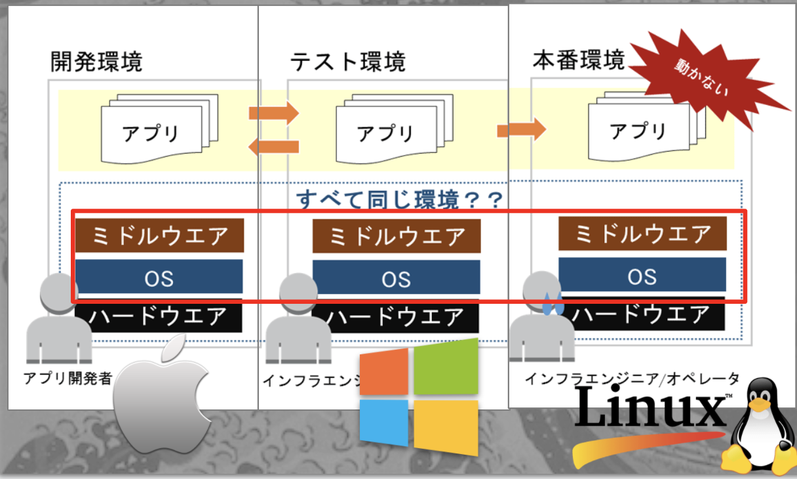

# 1. Intro

## 1. ドッカー？何それ美味しいの？ (What is Docker?)

ドッカーは食べられません！
でもこの可愛いクジラさんは、エンジニア的にはかなりオイシイツールなんです

## 2. Why Docker?

- Docker は毎年のように人気度が増えていて、2020 年現在、インフラと Development を融和させる DevOps という風潮の中では、なくてはならない存在です

## 3. Docker Benefits

**コードを速く正確にユーザに届けられるようになるからです**

BEFORE:

- 今までは Developer がコードを書いて、そのコードをインフラエンジニアに渡して、インフラが環境変数やライブラリーのインストールを本番環境でしていたんですね
- ただここで問題なのが、開発・テスト・本番環境が同一でないということなんですね
- つまり OS が違えばライブラリーのバイナリーも違い、「開発環境では動いてたのに本番では不動作が起きる」なんてよくあることなんですね。

AFTER:

- 開発チームがコードとライブラリーをパッケージングして docker image を作り（**コンテナ化**）、運営チームにドッカー Image をそのまま渡すことで、ライブラリーや Dependency の食い違いを防げるんですね

**コンテナ化の例え**:

- 例えで言うと、引っ越しの時にダンボールで荷造りをすることで、業者が運びやすくなるのと似ています
- Docker っていうのはコンテナという技術を使ってコードとライブラリーやパッケージをパッキングすることなんですね。

## 4. Pre-Container vs Post-Container Deployment Method

**Deploy する最小単位のアーティファクトが、従来のファイル(.war, .jar, .py, .js)やフォルダー(.zip)から、コンテナ（コード＋パッケージ）に代わり、OS 環境問わず同一の動作をする**

BEFORE:

- 今までは、ファイルやフォルダーを Jenkins などの CICD パイプラインを使って、本番環境のサーバーにコピーしていました

AFTER:

- ドッカーでは、コードとライブラリーをパッケージングして docker image を作り、本番環境のサーバーにドッカーイメージをダウンロードして、それを実行するだけで OK になります
- つまり Deploy する最小単位のアーティファクトが、コンテナ（コード＋パッケージ）に代わり、OS 環境問わず同一の動作をするんですね

## 5. VM (virttualization) vs Container

BEFORE:

- 従来の仮想化は、1 つの OS 上に複数の仮想 OS を置いて，そこでアプリケーションを動かしていました

AFTER:

- ただ Docker の場合は、1 つの OS に Docker engine を起動して複数のコンテナを起動します

More Container Benefits:

- リソースが軽い
  - OS を複数使わない分オーバーヘッド（複数の OS イメージとカーネル）が減り、プロセッサやメモリの消費が少なくなります
- ストレージの使用量が減る
  - OS イメージの通常サイズが５ − １０ GB に対し、Docker Image のサイズは 1− ２ GB なのでストレージの使用量も減ります。
- 起動時間が速い
  - カーネルをいちいちロードする手間が省け、仮想マシンに比べて起動時間が短くなります
- 複数環境での運営が楽
  - Docker がインストールされてる OS ならどこでもコンテナが起動できます。

## 6. Docker Image vs Docker Container

**イメージとコンテナの違いは、例えで言うと、Class と Object、車の設計図と実際の車、のようにテンプレート vs 実物と言う違いです**

## 7. Docker Client vs Docker Daemon (Docker Client-Server Architecture)

プログラマーだとインフラ設計経験がない人もいると思うのでクライアント・サーバーと言われても「何それ？」ってなるかもしれません

**クライアント・サーバーアーチテクチャの例え**:

- 簡単な例えだと、カスタマーサポートチャットがいい例だと思います

ドッカーも似たように、入力画面とコマンドラインがクライアント、実際にコンテナを装備するのがサーバーです

そしてドッカーデーモンとは、裏方で動いているプロセスなので Daemon process とか Agent とか言われます。

## 8. Install Docker (in 2020)

Docker Desktop for Mac :
https://docs.docker.com/docker-for-mac/install/

Docker Desktop for Windows:
https://docs.docker.com/docker-for-windows/install/

Linux:
https://docs.docker.com/engine/install/

## 9. Browser-based Docker playground

[Docker Playground](https://labs.play-with-docker.com/)

[Katacoda](https://www.katacoda.com/courses/docker/playground)

---

NEXT > [2. Intro to Basic Linux Commands and Concepts](../2_Linux_Basics/README.md)
